# Phantom3D

<a href="./fig/3Dprint_1_cor.jpg"></img>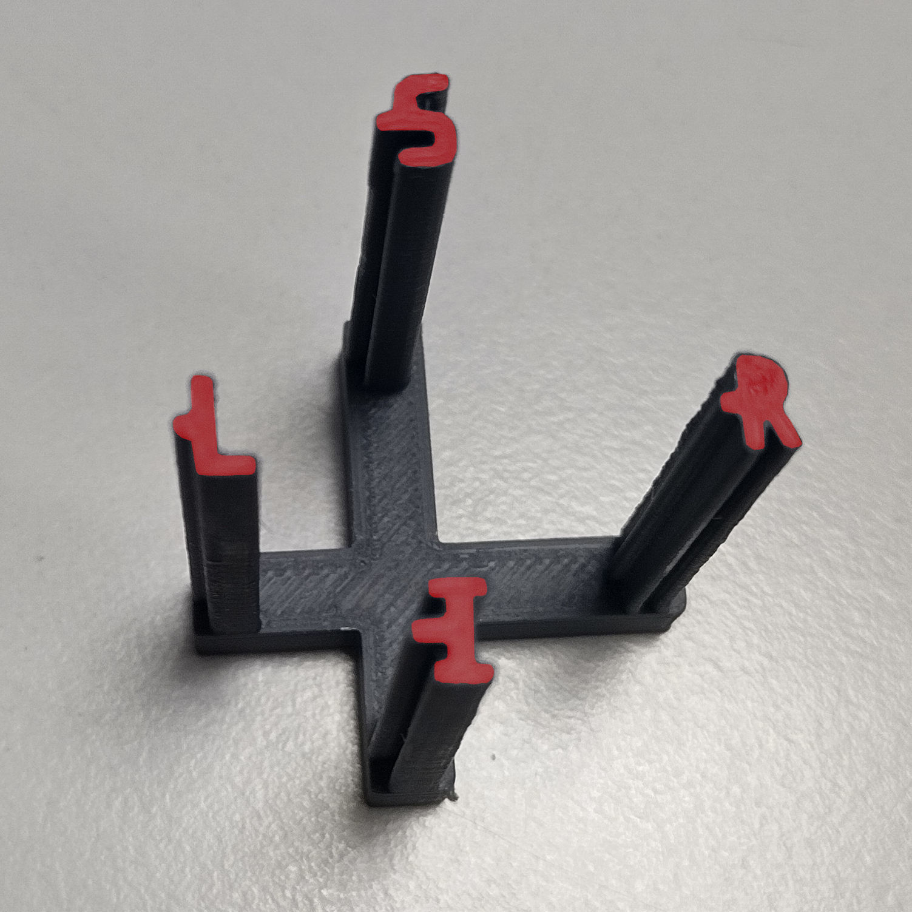</img></a>
<a href="./fig/3Dprint_2_sag.jpg">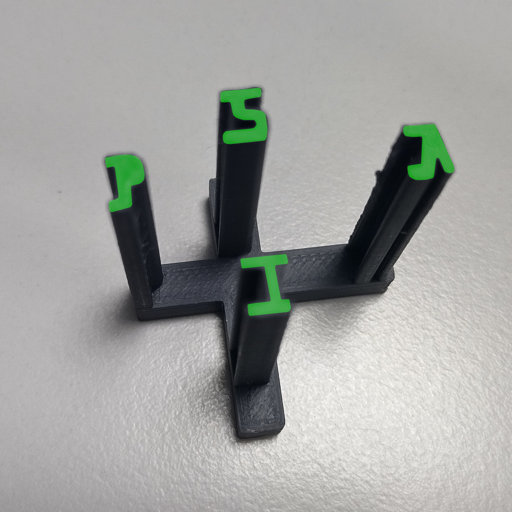</img></a>
<a href="./fig/3Dprint_3_axi.jpg">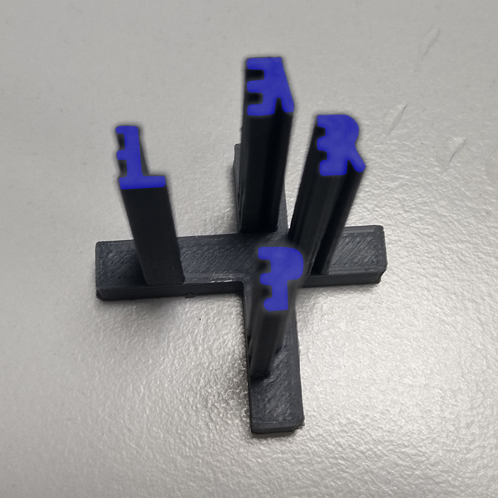</img></a>
<a href="./fig/3Dprint_all_1.jpg">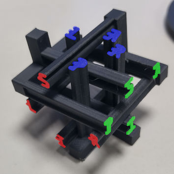</img></a>
<a href="./fig/3Dprint_all_2.jpg">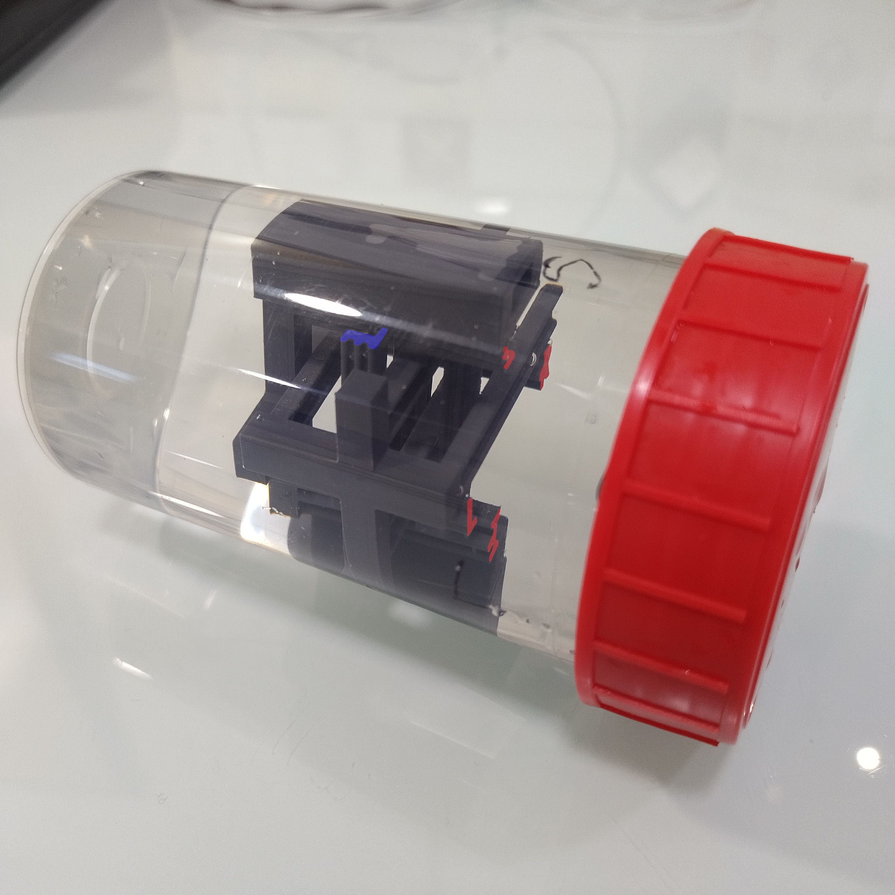</img></a>

This project content files for constructing a 3D phantom used in MRI or CT scanners to test, train and validate image acquisitions during development of acquisition sequences or experimental protocols. 
The phantom is constructed with 3 parts than can be easily printind on 3D printers. 
3D items are designed with the free software [Blender](https://www.blender.org/) and the exported templates for printing are given in the [STL format](https://en.wikipedia.org/wiki/STL_(file_format)). 
The phantom is designed to obtain anatomical views in neurological conventions, from the left (L) to right (R) axis, the inferior (I) to superior (S) axis, and the posterior (P) to anterior (A) axis. 
This coordinate system is used in neuroimaging, for example when working with the [NIfTI format](https://nifti.nimh.nih.gov/) and [BIDS standard](https://bids-specification.readthedocs.io/en/stable/).  

<a href="./fig/anat_T2w.jpg">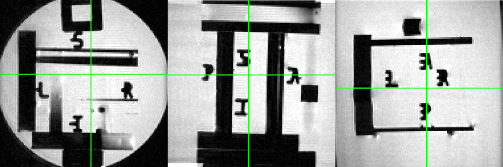</img></a>

<a href="./fig/anat_ct.jpg">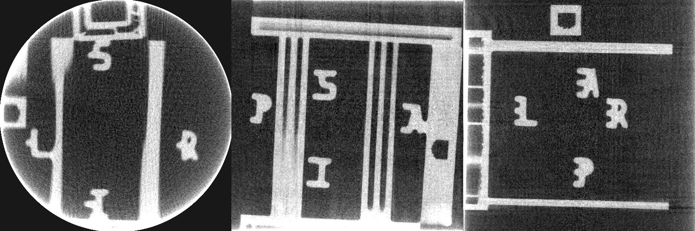</img></a>

The project is structured as follows: 
- /distrib: old and versioned files. 
- /src: contents current and associated files 
- /fig: contents some figures.
- /derivatives: contents code to:
    - __Create templates__ for MRI and CT scans in RAS coordinate systems (NIfTI);
    - __Detect the orientation__ of the phantom in 3D recordings;
    - __Fix__ the affine transformation for incorrectly oriented NIfTI files.

Here is a description of the main files 

<table>
    <tr><th width="25%">file</th><th width="50%">description</th><th width="25%">image</th></tr>
    <tr><td>phantom1</td><td>1st part of the phantom to obtain coronal slices with LR IS axes</td><td><a href="./fig/blender_view1.jpg">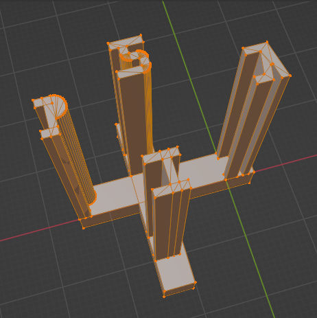</img></a></td></tr>
    <tr><td>phantom2</td><td>2nd part ... sagittal slices with PA IS </td><td><a href="./fig/blender_view2.jpg">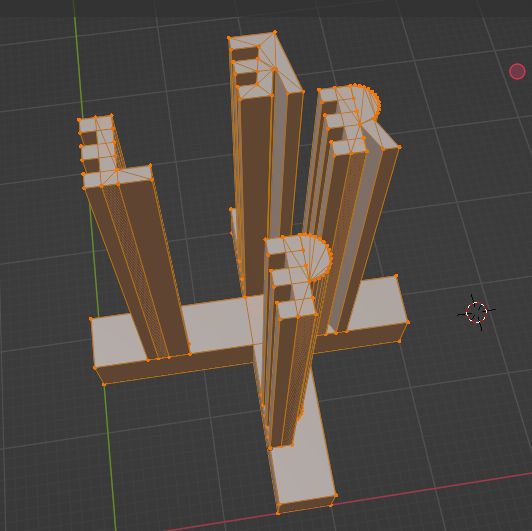</img></a></td></tr>
    <tr><td>phantom3</td><td>3rd part ... axial slices with LR PA</td><td><a href="./fig/blender_view3.jpg">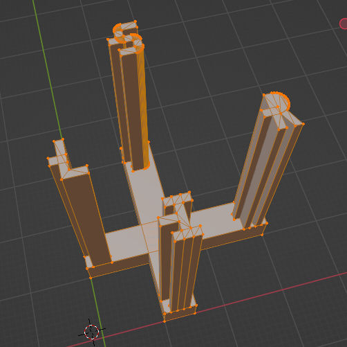</img></a></td></tr>
    <tr><td>cube</td><td>a cube with texture mapping containing LR PA IS letters</td><td><a href="./fig/cube.jpg">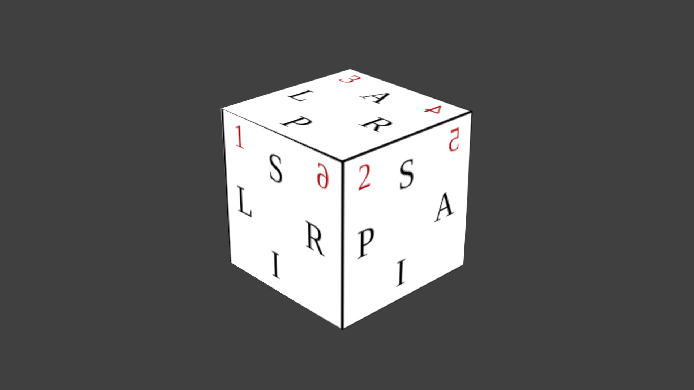</img></a></td></tr>
    <tr><td>disk</td><td>disk to evacuate bubbles when the phantom is filled with water</td><td><a href="./fig/blender_disk.jpg">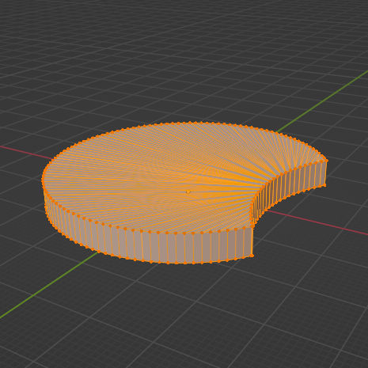</img></a></td></td></tr>
    <tr><td>maintainer1</td><td>1st block to maintain the structure in a cylinder</td><td><a href="./fig/blender_maintainer1.jpg">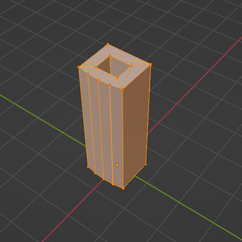</img></a></td></td></tr>
    <tr><td>maintainer2</td><td>2nd block to maintain the structure in a cylinder</td><td><a href="./fig/blender_maintainer2.jpg">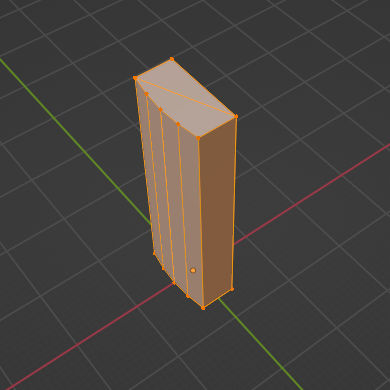</img></a></td></td></tr>
</table>

More information are given in publication. 

Blender 3.0.1 is used here. 

Author: Guillaume J.P. C. Becq  
Date: 2025-03-04  
